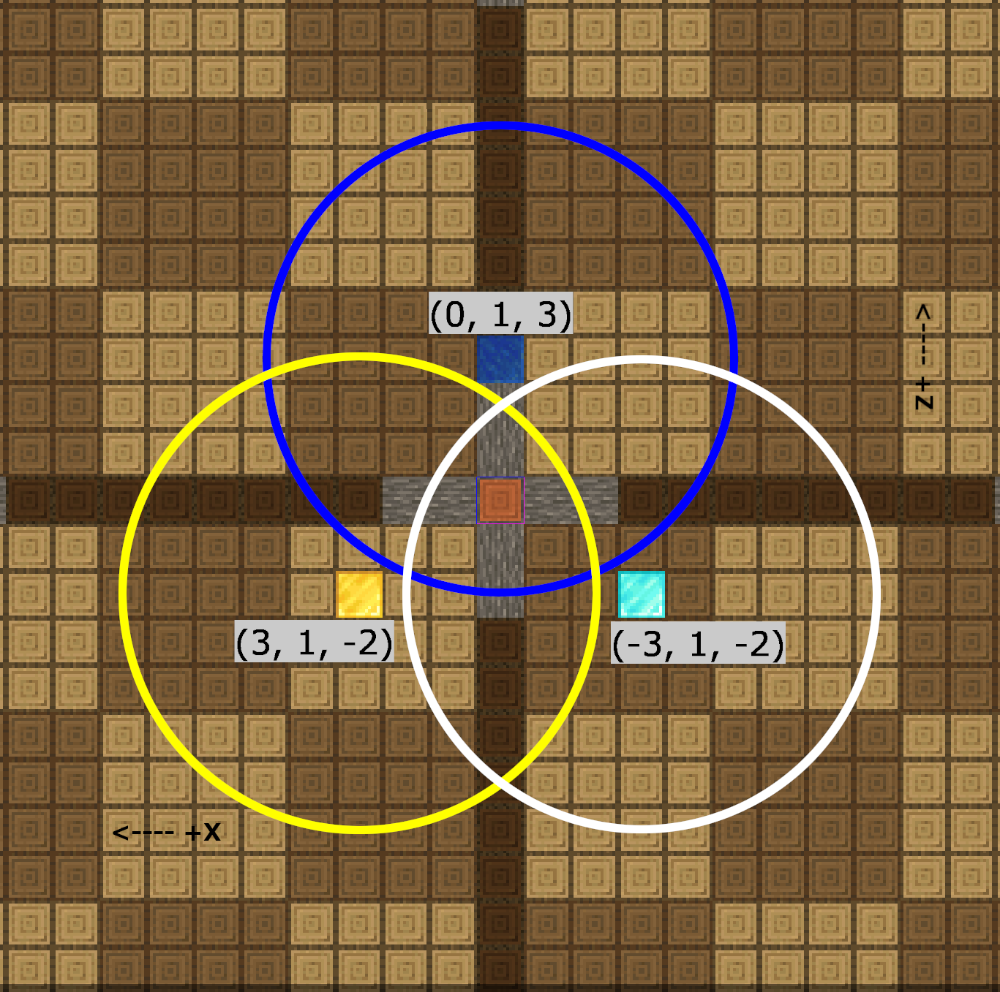

<!-- Explanation of how to use goals in mineflayer-pathfinder. Made by Jovan04 06/07/2023 -->

# Mineflayer-Pathfinder: Goals
## A (more) detailed explanation by Jovan04

This page is an explanation about goals in mineflayer-pathfinder. A `Goal` is an instance of a class that allows the user to specify a location that they want a mineflayer bot to go to. Goals are the backbone of mineflayer because they provide an easy way to control your mineflayer bot with mineflayer-pathfinder.  

### General Goals
It's useful to think about goals in pathfinder as conditions that need to be fulfilled. For example, one of the most common goals is `GoalBlock`. As the [documentation](../../readme.md#goals) for the `GoalBlock` goal says:

> One specific block that the player should stand inside at foot level

Thus, we have our condition. In order to complete the `GoalBlock` goal, our bot needs to get its feet inside the specified block. Simple as that.  
That's great and all, but how do we use it?  
[Here's](./basic.js) a quick example. Let's walk through everything it does.

First, we need to import mineflayer, as well as pathfinder and things related to it:  
```js
const mineflayer = require('mineflayer')
const { pathfinder, Movements, goals:{ GoalBlock } } = require('mineflayer-pathfinder')
```
Here, we import a few things from pathfinder:
* the pathfinder plugin itself
* the Movements() class, which defines how our bot is allowed to move
* the `goals` object, and from it the `GoalBlock` goal  

Next, we'll create our bot. This is just like creating any other Mineflayer bot:  
```js
const bot = mineflayer.createBot({
  host: 'localhost',
  port: 25565,
  username: 'Pathfinder',
  auth: 'offline'
})
```

We'll also add a `spawn` event listener to load the pathfinder plugin and create the bot's Movements class:  
```js
bot.once('spawn', () => {
  bot.loadPlugin(pathfinder) // load pathfinder plugin into the bot
  const defaultMovements = new Movements(bot) // create a new instance of the `Movements` class
  bot.pathfinder.setMovements(defaultMovements) // set the bot's movements to the `Movements` we just created
})
```
The `Movements` class essentially tells the bot what moves it's allowed to make. This includes, but isn't limited to: What blocks (if any) it can place/break, whether it can pillar straight up, and how far it's allowed to fall.  
What we've done so far is mostly boilerplate; you'll probably use it every time you use pathfinder.  

Now, we'll create a chat listener that we'll use to make pathfinder move:  
```js
bot.on('chat', async (username, message) => {
  if (username === bot.username) return // make bot ignore its own messages

  if (message === 'go') { // this is our trigger message (only works on servers with vanilla chat)
    // our pathfinder code goes here!
  }
})
```

Now, let's go back to the `GoalBlock` goal. If we look at the documentation again, we can see that the GoalBlock takes three arguments: an `x` coordinate, a `y` coordinate, and a `z` coordinate, all integers. In order to use the `GoalBlock` goal, we would need to create a new instance of the `GoalBlock` class with those coordinates. If we wanted our bot to pathfind to the coordinates **15, 3, 75**, we could do that like this:
```js
const myGoal = new GoalBlock(15, 3, 75)
```

Now that we have our goal, how do we use it? Simple! Pathfinder has a method for traveling to a goal, `goto`. We can access it through `bot.pathfinder.goto(goal)`, and we'll use the `await` Javascript keyword to make our code wait for the bot to finish walking to the goal beore continuing:
```js
await bot.pathfinder.goto(myGoal)
```

We can also use `bot.chat` to have the bot tell us when it starts and finishes going to the goal. If we add that to the lines we just wrote, it can look something like this:
```js
bot.chat('Going to my goal!')
const myGoal = new GoalBlock(15, 3, 75)
await bot.pathfinder.goto(myGoal)
bot.chat('Arrived at my goal!')
```

Let's put those four lines inside our chat listener, likeso:
```js
bot.on('chat', async (username, message) => {
  if (username === bot.username) return // make bot ignore its own messages

  if (message === 'go') { // this is our trigger message (only works on servers with vanilla chat)
    bot.chat('Going to my goal!')
    const myGoal = new GoalBlock(15, 3, 75)
    await bot.pathfinder.goto(myGoal)
    bot.chat('Arrived at my goal!')
  }
})
```

And now we're done! We can type `go` in chat, and the bot will walk to the coordinates we specified. Remember that `GoalBlock` makes the bot put its feet in the block we specified. You can view and download the full example script [here](./basic.js).

And, there you have it. That's how you use the `GoalBlock` goal! Most of the other goals are used in a similar way, but with different arguments. You can look at [the documentation](../../readme.md#goals) for those. However, there are a few goals that are a little confusing.  

### Composite Goals
The Composite goals, `GoalCompositeAny` and `GoalCompositeAll`, are both quite different from most other goals. Instead of being standalone goals themselves, they allow you to combine other goals in interesting ways. They're called *compos*ite goals because they're *compos*ed of (or made up of) other goals. But before we can talk about the composite goals in more detail, we should talk about the `GoalNear` goal. The composite goals are made up of other goals, and `GoalNear` is a good example.  

`GoalNear` is almost the same as `GoalBlock`, but with one extra argument. Where `GoalBlock` only has `x, y, z`, `GoalNear` has `x, y, z, range`. The additional argument, `range`, specifies how far away from the target block the bot can be in order to still satisfy the goal. For example, the goal `GoalNear(15, 3, 75, 5)` would be satisfied once the bot is within 5 blocks of **15, 3, 75**.  

Now, let's set up our program to use composite goals.  

In the [composite goal example](./goalComposite.js), we make three goals: `LapisGoal`, `GoldGoal`, and `DiamondGoal`. They correspond to standing within 5 blocks of a Lapis block, a Gold block, and a Diamond block, respectively (see picture below):  
```js
  const LapisGoal = new GoalNear(0, 1, 3, 5) // our bot needs to stand within 5 blocks of the point (0, 1, 3) in order to satisfy this goal (blue circle below)
  const GoldGoal = new GoalNear(3, 1, -2, 5) // our bot needs to stand within 5 blocks of the point (3, 1, -2) in order to satisfy this goal (yellow circle below)
  const DiamondGoal = new GoalNear(-3, 1, -2, 5) // our bot needs to stand within 5 blocks of the point (-3, 1, -2) in order to satisfy this goal (white circle below)
```


#### GoalCompositeAny
The first type of composite goal is called `GoalCompositeAny`. Being a composite goal, `GoalCompositeAny` is a goal made up of other goals. In order for your bot to complete `GoalCompositeAny`, it needs to satisfy *any one* of the contained goals. Above, we made three goals (`LapisGoal`, `GoldGoal`, and `DiamondGoal`).  
Let's put them into an array:  
```js
const goalsArray = [LapisGoal, GoldGoal, DiamondGoal] // array containing all three of our goals; we'll use this array in our `GoalCompositeAny` goal
```
And create a new `GoalCompositeAny` with that array:  
```js
const goalAny = new GoalCompositeAny(goalsArray)
```
Now, just like any other goal, we can tell pathfinder to `goto` our new `GoalCompositeAny`:  
```js
await bot.pathfinder.goto(goalAny)
```
The `GoalCompositeAny` is completed when the bot completes any one of the goals it was created with. For our example above, `goalAny` will be completed when the bot completes any one of `LapisGoal`, `GoldGoal`, or `DiamondGoal`. In other words, `goalAny` will be completed when the bot's location is inside the blue circle *or* the yellow circle *or* the white circle (see image above).  

#### GoalCompositeAll
The other type of composite goal is called `GoalCompositeAll`. Being a composite goal, `GoalCompositeAll` is a goal made up of other goals. In order for your bot to complete `GoalCompositeAll`, it needs to satisfy *all* of the contained goals. Above, we made three goals (`LapisGoal`, `GoldGoal`, and `DiamondGoal`).  
Let's put them into an array:  
```js
const goalsArray = [LapisGoal, GoldGoal, DiamondGoal] // array containing all three of our goals; we'll use this array in our `GoalCompositeAll` goal
```
And create a new `GoalCompositeAll` with that array:  
```js
const goalAll = new GoalCompositeAll(goalsArray)
```
Now, just like any other goal, we can tell pathfinder to `goto` our new `GoalCompositeAll`:  
```js
await bot.pathfinder.goto(goalAll)
```
The `GoalCompositeAll` is completed when the bot completes all of the goals it was created with. For our example above, `goalAll` will be completed when the bot completes all of `LapisGoal`, `GoldGoal`, or `DiamondGoal`. In other words, `goalAll` will be completed when the bot's location is inside the blue circle *and* the yellow circle *and* the white circle (see image above). It's important to clarify that the bot needs to be in all three circles at the same time. Going from one circle to another to the last is not a valid path to complete the goal.  

And there you have it! That's a basic introduction to using goals in mineflayer-pathfinder. If any of this was confusing, or you'd like help with something more complicated, feel free to join the [PrismarineJS Discord server](https://discord.gg/GsEFRM8). We're always happy to provide help for mineflayer and other PrismarineJS libraries.
